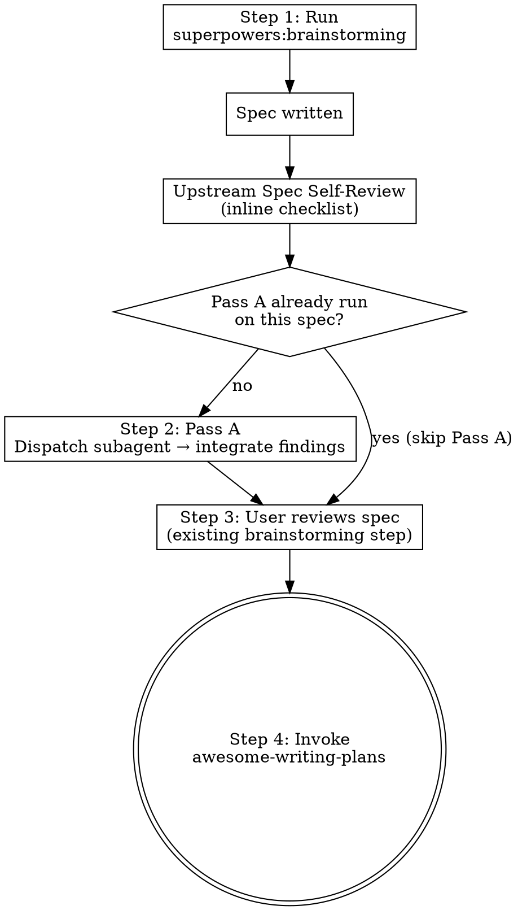

# Awesome Brainstorming

## Overview

Project-level wrapper for `superpowers:brainstorming` that adds a single fresh-subagent rigor pass after the spec is written and before user spec review. The pass asks "what realistic failure modes does this design need to defend against?" and integrates the answers into the spec, reporting a one-line summary in chat — the user reviews the full, strengthened spec in the existing user-review step.

**Announce at start:** "I'm using the awesome-brainstorming skill — brainstorm with a test-rigor pass before plan handoff."

**Core principle:** Run upstream brainstorming → Pass A rigor review → gaps integrated + one-line summary in chat → user reviews stronger spec → handoff to awesome-writing-plans.

## The Process



### Step 1: Run upstream brainstorming

Invoke `superpowers:brainstorming`.

Run it to completion through its own "Write design doc" → "Spec self-review" steps. **Do not** proceed to the upstream skill's "User reviews spec" step until Pass A runs (Step 2). The override inserts between self-review and user-review.

### Step 2: Pass A — Test-Rigor Review (1 shot)

**Idempotency check (skip if already run):**

Inspect the most recent commit touching the spec file:

```bash
git log -1 --format=%s -- <SPEC_PATH>
```

If the most recent commit message contains the string `Pass A rigor review`, skip the rest of Step 2 and proceed to Step 3. Pass A already ran on this spec — re-running would re-flag the same gaps and produce duplicate edits.

**Dispatch the subagent:**

Use the Agent tool with `subagent_type: general-purpose` and the following dispatch prompt. Substitute `[SPEC_TOPIC]` with the spec's title (from frontmatter or first heading) and `[SPEC_PATH]` with the absolute path to the spec file.

```
We've just brainstormed [SPEC_TOPIC]. I want it to be the kind of design we'd
both be happy to plan against — strong enough that the implementation plan
built on top won't be undermined by missing failure-mode coverage.

Could you take a fresh look at the spec at [SPEC_PATH] and tell us:

  1. What realistic failure modes does this design need to defend against?
  2. Which of those are addressed in the spec? Which aren't?
  3. For each unaddressed mode, what would the design need to add — a test
     category, a guarantee, a section?

Be honest and direct — we want to find the gaps, not validate what's there.
But be specific: vague "needs more rigor" critiques aren't useful.

Return:
  - A list of unaddressed failure modes, each with a one-line rationale.
  - A list of suggested additions to close each gap (test category, design
    section, guarantee, etc.).
  - "No critical gaps" if the spec already covers the realistic failure modes.
```

**Handle the response:**

| Response | Action |
|---|---|
| "No critical gaps" | Note "Pass A complete, no spec changes needed" in chat. Proceed to Step 3. |
| Gap list with suggested additions | Continue below. |

**Integrate the findings:**

For each suggested addition, edit the spec file to absorb it. Typical edits:

- Add or expand a Testing section (preferred section name: `## Testing` or `## Validation`).
- Add a new bullet under an existing design section if the gap is design-level (not test-level).
- Add a new section if the gap doesn't fit existing structure (e.g., `## Risks` if missing).

**Report the pass in one line in chat** (e.g., "Pass A found 3 gaps: added Testing bullets for concurrent-write and empty-input cases, plus a Risks section") rather than pasting the subagent's raw output. The user reviews the full, integrated spec in Step 3 — nothing is withheld; the one-liner just keeps chat noise down between review steps.

**Commit the changes:**

```bash
git -C <WORKTREE_PATH> add <SPEC_PATH>
git -C <WORKTREE_PATH> commit -m "spec: absorb Pass A rigor review for <topic>

<one-line summary of categories added>"
```

The commit message **must contain the string `Pass A rigor review`** — this is the idempotency marker.

**Error handling:**

| Case | Action |
|---|---|
| Subagent dispatch errors (network, rate limit) | Retry once. If still failing, surface error to user; let them decide whether to skip Pass A for this spec. Never block planning indefinitely. |
| Subagent returns vague/unactionable critique ("needs more rigor") | Re-dispatch with explicit "be specific or return 'no critical gaps'" framing. If still vague after one retry, surface to user. |
| Spec file path contains spaces or special chars | Quote the path in all bash invocations. |

### Step 3: User reviews spec

This is the existing `superpowers:brainstorming` user-review step. The user sees one diff (the spec with Pass A integrations already applied). On approval, proceed to Step 4.

If the user requests changes, apply them to the spec and return to Step 3. Pass A does not re-run — it is single-shot per spec.

### Step 4: Handoff to awesome-writing-plans

Invoke `awesome-writing-plans` (the project-level override of `superpowers:writing-plans`). The new plan will absorb its own Pass B at end-of-plan.

## When to Skip Pass A

**Almost never.** Pass A is one dispatch — cheap and high-value. The only exception: if the user explicitly says "skip rigor" for this spec. Log the skip in the next commit message on the spec file (e.g., `spec: <topic> — Pass A rigor review skipped per user request`).

## Red Flags

- Running Pass A before upstream brainstorming's Spec Self-Review (out of order).
- Pasting the subagent's raw gap list into chat instead of integrating it into the spec and reporting a one-line summary.
- Forgetting the `Pass A rigor review` idempotency marker in the commit message — causes Pass A to re-run if the session resumes.
- Looping Pass A (it is single-shot by design).
- Treating the spec as locked after Pass A — the user-review step is still authoritative.

## Integration

**Replaces direct use of:**
- `superpowers:brainstorming` for project work.

**Invokes (in order):**
1. `superpowers:brainstorming` (Step 1)
2. Subagent dispatch via Agent tool (Step 2)
3. `awesome-writing-plans` (Step 4)
