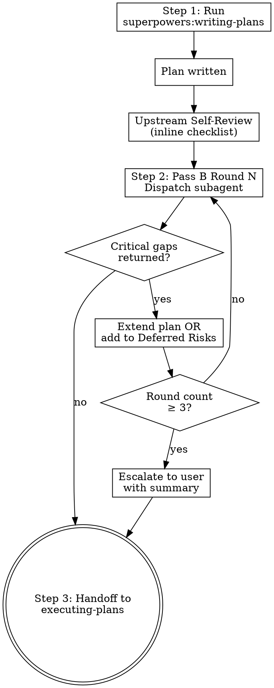

# Awesome Writing Plans

## Overview

Project-level wrapper for `superpowers:writing-plans` that adds a fresh-subagent rigor review loop after the plan is written and before handoff to executing-plans. Each round asks "what realistic failure mode would survive these tests?" and the main agent either extends the plan with a closing test or marks the gap out-of-scope with a written rationale. Loop runs up to 3 rounds; terminates on 0 critical gaps or escalates to the user with a summary.

**Announce at start:** "I'm using the awesome-writing-plans skill — write the plan with a ≤3-round test-rigor pass before handoff."

**Core principle:** Run upstream writing-plans → Pass B rigor loop → extend or defer each critical gap → handoff to executing-plans.

## The Process



### Step 1: Run upstream writing-plans

Invoke `superpowers:writing-plans`.

Run it to completion through its own "Self-Review" step. **Do not** proceed to the upstream skill's "Execution Handoff" step until Pass B runs (Step 2). The override inserts between self-review and execution-handoff.

### Step 2: Pass B — Test-Rigor Review Loop (≤3 rounds)

**Per round:**

**Dispatch the subagent:**

Use the Agent tool with `subagent_type: general-purpose` and the following dispatch prompt. Substitute `[PLAN_NAME]` with the plan's title and `[PLAN_PATH]` with the absolute path to the plan file.

```
We've drafted this Testing section for [PLAN_NAME] at [PLAN_PATH]. I want
it to be genuinely strong — the kind of testing that would make us both
happy to ship the plan against.

Could you take a fresh look at the plan and tell us:

  1. What realistic failure mode would survive these tests?
  2. What test categories haven't we considered? Be specific.
  3. For each gap, what test would close it?

Tag each gap as one of:
  - "critical" — could allow silent failure, data loss, or a regression
                 that wouldn't surface until production.
  - "minor"    — advisory, nice-to-have, not loop-blocking.

Be honest and direct — we want to find the gaps, not validate what's there.
But also be specific: vague "needs more testing" critiques aren't useful.

Return:
  - A list of gaps, each with severity tag, one-line rationale, and a
    concrete test that would close it.
  - "No critical gaps" if the plan's tests already cover the realistic
    failure modes that survive them.
```

**Handle the response:**

| Response | Action |
|---|---|
| "No critical gaps" | Loop terminates. Proceed to Step 3. |
| List of gaps with severity tags | Continue below. |

**For each gap returned:**

- If severity is `minor` — note in chat (advisory), do **not** modify the plan, do **not** count toward round termination.
- If severity is `critical` — choose one of two responses:

  **Response A: Extend the plan.** Edit the plan file to add a task or test step that closes the gap. Show the diff in chat with a one-line rationale.

  **Response B: Mark out-of-scope.** Edit the plan to add or extend a `## Deferred Risks` section near the end of the plan, with this format:

  ```markdown
  ## Deferred Risks

  Failure modes acknowledged but not closed by this plan. Each entry has a
  rationale for why catching it here isn't worth the cost, and a note on
  what would change the call.

  - **[Gap summary]** — [why it's not in scope] — [what would change the call]
  ```

  The Deferred Risks section is **part of the plan**, not a side note. An engineer executing the plan must see it.

**User pushback handling:** If the user pushes back on a flagged gap ("that's not actually a failure mode"), record the user's reasoning in the Deferred Risks section and do not re-flag it. Audit trail captures why.

**Commit after each round:**

```bash
git -C <WORKTREE_PATH> add <PLAN_PATH>
git -C <WORKTREE_PATH> commit -m "plan: Pass B round <N> — <one-line summary of changes>"
```

The commit message **must contain the string `Pass B round`** for audit traceability.

**Round termination:**

After addressing all critical gaps in the current round, re-dispatch the subagent (next round). Loop continues until:

- Subagent returns "No critical gaps" — terminate, proceed to Step 3.
- Round count reaches 3 — escalate to user (see below).

**Round-3 escalation:**

If round 3 completes with unresolved critical gaps, surface a summary to the user:

> "Pass B reached round 3 with N unresolved critical gaps:
>
>   1. [gap summary] — suggested closing test: [test]
>   2. ...
>
> Options:
>   (a) Extend the plan further (re-dispatch round 4 manually).
>   (b) Mark all remaining gaps out-of-scope (Deferred Risks).
>   (c) Proceed anyway.
>
> What would you like to do?"

The user's choice is recorded in the next plan commit message. Proceed to Step 3 after the user responds.

**Error handling:**

| Case | Action |
|---|---|
| Subagent dispatch errors (network, rate limit) | Retry once. If still failing, surface error to user; let them decide whether to skip the rest of Pass B for this plan. Never block planning indefinitely. |
| Subagent returns vague/unactionable critique ("needs more testing") | Re-dispatch with explicit "be specific or return 'no critical gaps'" framing. If still vague after one retry, surface to user. |
| Subagent returns only `minor` gaps for 3 consecutive rounds | Treat as "no critical gaps" — terminate. |

### Step 3: Handoff to executing-plans

This is the upstream `superpowers:writing-plans` Execution Handoff with the message shape made explicit — the upstream one-liner ("Plan complete and saved to `<path>`. Which approach?") is **replaced** by the following. The user can see only chat messages and question dialogs; the plan file, Pass B commits, and subagent reports are all invisible to them, so the handoff is one message with two parts, in order:

1. **The plan digest, rendered in chat.** Read the plan file and post:
   - The task list — each task's number, title, and one-line deliverable.
   - The `## Deferred Risks` section verbatim, if present.
   - One line on what Pass B did (rounds run, gaps closed vs. deferred), with the plan path.
2. **The execution-choice ask.** Then present the two upstream options (Subagent-Driven recommended, Inline Execution) and proceed per user choice.

The same rule holds for any other question this skill asks (the round-3 escalation included): whatever plan content, gap, or diff the question refers to appears in chat text before the ask — a file path is a location, not content.

## Re-runnability

Pass B can be re-invoked manually mid-execution if the user says something like "we hit something the plan didn't catch — re-run Pass B with this new context". Treat the re-invocation as a fresh round 1 (not round 4 of the original loop). Cap still applies.

## When to Skip Pass B

**Almost never.** Pass B is at most 3 dispatches — cheap and high-value. The only exception: if the user explicitly says "skip rigor" for this plan. Log the skip in the next commit message on the plan file (e.g., `plan: <feature> — Pass B rigor review skipped per user request`).

## Red Flags

- Asking "which execution approach?" (or any approval question) when no plan content has been posted in chat — "saved to `<path>`" shows the user a location, not the plan; post the Step 3 digest first.
- Running Pass B before upstream writing-plans' Self-Review (out of order).
- Treating `minor` gaps as round-terminating (they aren't).
- Skipping commits between rounds — each round must be atomic and auditable.
- Forgetting the round counter (must terminate at 3 or escalate).
- Failing to record user pushback in Deferred Risks — audit trail must capture why a gap was dismissed.

## Integration

**Replaces direct use of:**
- `superpowers:writing-plans` for project work.

**Invokes (in order):**
1. `superpowers:writing-plans` (Step 1)
2. Subagent dispatch via Agent tool, looped (Step 2)
3. `superpowers:writing-plans` Execution Handoff section (Step 3)

**Called by:**
- `awesome-brainstorming` at end-of-brainstorm.
- Direct user invocation for plans not preceded by brainstorming.
