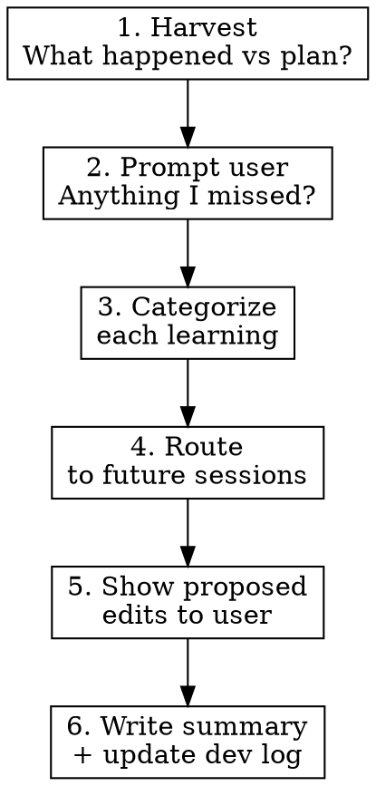

# End-of-Session Reflection

## Overview

Structured review at the end of every work session that harvests learnings and routes them into future session plans. Prevents knowledge loss between sessions.

## Scope

This skill covers **development work** — code, architecture, tooling, configuration,
and skills. It does not try to track non-development activity.

## When to Use

- User says "let's wrap up", "that's it for today", "we're done"
- Last step of a session plan is complete
- About to write a session summary
- About to update the project's build/dev log
- User asks to commit final session work

## Core Process

### 1. Harvest Learnings

Walk through the **development work** in the session and identify. Skip non-development activity entirely — if it didn't change code, config, architecture, or tooling, it doesn't belong here.

- **What changed from the plan?** Steps skipped, reordered, or added
- **What broke and how was it fixed?** Bugs, workarounds, quirks
- **Did any tool errors reveal ergonomic gaps?** When a tool fails because of *how* it was invoked (wrong directory, unexpected input format, missing auto-detection), that's a signal the tool isn't agent-native enough. A bug is "the code is wrong"; an ergonomic gap is "the code works as designed but the design doesn't match how agents use it." Capture these as improvement candidates — they compound across every future session.
- **What surprised us?** Unexpected behavior, UX gaps, missing requirements
- **What did the user express a preference about?** Workflow, UX, architecture, scope
- **What scope changed?** New dev requirements discovered, things deferred, things escalated (code/architecture only)
- **What is now dead code or dead plan?** If architectural decisions or scope changes made existing code, stubs, plan steps, or agent files unnecessary, identify them for deletion. Never carry forward mistakes or technical debt into the next session.

### 2. Prompt the User

Before finalizing, explicitly ask:

> "Here's what I captured from this session. Anything I missed or got wrong?"

Present the list. Wait for confirmation. Do NOT skip this step — the user often has insights that weren't explicit in the conversation.

### 3. Categorize Each Learning

Assign each learning one category:

| Category | Routes to |
|----------|-----------|
| **Bug/quirk** | `BACKLOG.md`/`TODO.md` (create if absent) |
| **UX preference** | Next session plan (specific step) + the project instructions file (`CLAUDE.md`), created if the learning is a stable convention and no file exists |
| **New requirement** | The relevant future plan, or `BACKLOG.md` if none exists yet |
| **Architectural insight** | Project instructions file or future plan |
| **Scope change** | Future plan or a `ROADMAP.md` (create if absent) |
| **Tool ergonomic gap** | `BACKLOG.md` |
| **Process improvement** | An updated skill or the project instructions file |

> **The project instructions file (`CLAUDE.md`) is a project bible — not a scratch pad.**
> It holds authoritative conventions, architecture, and rules that are always true.
> Never add bugs, workarounds, known issues, or lessons learned to it.
> Transient bugs → `BACKLOG.md`. Workflow learnings → skills or repo docs.
>
> **Do NOT route learnings to auto-memory.** Memory is per-project and doesn't
> travel with the codebase. Prefer portable skills and repo docs over per-project
> memory for reusable patterns. Use memory only for user preferences and personal
> context — never for reusable patterns or techniques.

### 4. Route to Future Plans

For each learning, identify the **specific file and section** it should update:

- Which session plan?
- Which step within that plan?
- Or does it go in the roadmap?
- Or does it update the project instructions file directly?

**Do not dump all learnings into a generic "notes" section.** Each learning goes to the exact place where it will be actionable when that work begins.

### 5. Propose Edits

Show the user each proposed edit to future session files before writing. Group by file for readability. The user may redirect a learning to a different session or reject it entirely.

### 6. Write Session Artifacts

After user approval:

1. **Session summary** — `sessions/YYYY-MM-DD-summary.md` (create `sessions/` if absent). Date-stamp the filename; do not use sequential `SESSION_<N>` numbering.
   - What was built and verified
   - What changed from the plan and why
   - Deferred items with reasons
   - Key learnings (brief — details are now in future session plans)

2. **Dev log** — append an entry to `CHANGELOG.md` or `docs/build-log.md` (pick one on first use, stay consistent; create if absent).

3. **Backlog** — update `BACKLOG.md`/`TODO.md` with any new bugs, scope changes, or deferred work (create if absent).

4. **Commit** the session summary, dev log update, backlog, and all updated future plans together, then complete the branch via `superpowers:finishing-a-development-branch`.

### Between Steps 5 and 6: Clean Up Dead Code and Plans

Before writing artifacts, delete anything made unnecessary by this session's decisions:

- **Dead code**: stubs, agents, skills, CLI commands that will never be implemented
- **Dead plan steps**: steps in future session plans that reference deleted code
- **Stale inventory entries**: project instructions file agent/skill tables that list things that no longer exist
- **Orphaned files**: test fixtures, configs, or docs for removed features

This is not optional. Carrying forward dead code or plans creates confusion in future sessions and accumulates technical debt. If a decision was made to not build something, delete every trace of it now.

## Red Flags — You're Skipping Reflection

- Writing a session summary without reviewing what changed from the plan
- Updating the dev log without checking future session plans
- Committing "session complete" without asking the user what they learned
- Putting all learnings in the summary instead of routing to future plans
- Saying "all learnings captured" without showing the user the list
- Leaving dead code, stubs, or plan steps for things that were decided against

## Common Mistakes

| Mistake | Fix |
|---------|-----|
| Dumping learnings into session summary only | Route each learning to the future plan where it's actionable |
| Not prompting the user | User has context you don't — always ask |
| Generic routing ("add to Session 2") | Specific routing (name the file, step, and subsection) |
| Forgetting to update the roadmap | Scope changes and big ideas belong in the roadmap, not stuffed into the next session |
| Writing the summary before routing learnings | Route first, then summarize — the summary references where learnings went |
| Adding bugs/workarounds to the project instructions file | **NEVER.** It is a project bible. Bugs → `BACKLOG.md`. Workarounds → skills or repo docs. |
| Routing learnings to auto-memory | Memory doesn't travel with the project. Use skills (portable) or repo docs (travels with code). |
