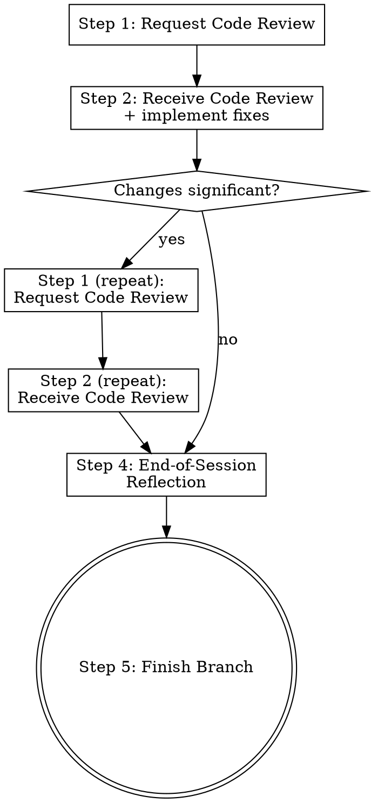

# Finishing With Review

## Overview

Review-gated branch completion. Every branch gets reviewed before it merges — no exceptions.

**Announce at start:** "I'm using the finishing-with-review skill to review and complete this work."

**Core principle:** Implement → Review → Reflect → Finish. Code review happens while the code is fresh and there's still willingness to change it.

## The Process



### Step 1: Request Code Review

Invoke `superpowers:requesting-code-review`.

1. Get the git range. Resolve the base branch robustly — this works on a fresh
   repo with no remote, on `master`/`main`/`trunk`, and warns rather than
   producing a garbage range if nothing resolves:

```bash
# >>> base-branch-detection >>>
set -euo pipefail
resolve_base_ref() {
  # Echo a ref usable DIRECTLY in `git merge-base` — a remote-tracking ref when
  # one exists (so a clone with origin/main but no local main still works), else
  # a local branch. Never strips the remote prefix off a ref that needs it.
  # Tier 1: the remote's declared default branch (remote-tracking ref, e.g. origin/main).
  if git symbolic-ref -q refs/remotes/origin/HEAD >/dev/null 2>&1; then
    git symbolic-ref --short refs/remotes/origin/HEAD
    return 0
  fi
  # Tier 2: the current branch's configured upstream (remote-tracking ref).
  if git rev-parse -q --verify '@{upstream}' >/dev/null 2>&1; then
    git rev-parse --abbrev-ref '@{upstream}'
    return 0
  fi
  # Tier 3: a conventional LOCAL branch, if one exists.
  local b
  for b in main master trunk; do
    if git rev-parse -q --verify "refs/heads/$b" >/dev/null 2>&1; then echo "$b"; return 0; fi
  done
  return 1
}
# Guard every command substitution explicitly — `BASE_SHA=$(failing-cmd)` does NOT
# trip `set -e`, so a bad merge-base would otherwise leave BASE_SHA empty silently.
BASE_REF=""
if BASE_REF=$(resolve_base_ref) && [ -n "$BASE_REF" ] \
   && BASE_SHA=$(git merge-base HEAD "$BASE_REF" 2>/dev/null) && [ -n "$BASE_SHA" ]; then
  : # resolved cleanly; BASE_REF + BASE_SHA are valid
else
  echo "WARNING: could not resolve a base branch (BASE_REF='${BASE_REF:-<none>}'); review the full working tree manually." >&2
  BASE_REF="${BASE_REF:-<none>}"
  BASE_SHA=$(git rev-parse HEAD)   # degrade safely: empty range, reviewer is warned
fi
HEAD_SHA=$(git rev-parse HEAD)
# <<< base-branch-detection <<<
```

2. Dispatch the `superpowers:code-reviewer` subagent with:
   - `WHAT_WAS_IMPLEMENTED` — what you built this session
   - `PLAN_OR_REQUIREMENTS` — the plan file or requirements you were working from
   - `BASE_SHA` / `HEAD_SHA` — the full diff range
   - `DESCRIPTION` — brief summary

3. Wait for the reviewer's assessment.

### Step 2: Receive Code Review

Invoke `superpowers:receiving-code-review`.

1. **Read** the full feedback without reacting
2. **Verify** each issue against the codebase — is it real?
3. **Push back** on anything technically wrong (with reasoning)
4. **Implement fixes** in priority order:
   - Critical (must fix)
   - Important (should fix)
   - Minor (note for later — do not fix unless trivial)
5. **Classify your changes:**
   - **TRIVIAL**: renames, formatting, docs, import ordering, comment tweaks
   - **SIGNIFICANT**: new logic, changed control flow, modified interfaces, new error paths

### Step 3: Conditional Second Review

**IF Step 2 changes were SIGNIFICANT** — new logic, changed control flow, or modified interfaces:
- Commit the fixes
- Return to Step 1 with the new diff range (`BASE_SHA` = pre-fix commit)
- Complete Step 2 again
- No third cycle — two reviews maximum

**IF Step 2 changes were TRIVIAL** — or reviewer said "Ready to merge":
- Proceed to Step 4

### Step 4: End-of-Session Reflection

Invoke `end-of-session-reflection`.

This is the existing reflection workflow: harvest learnings, prompt the user, categorize, route them to durable homes, and write the session summary and dev log. All reflection artifacts are committed in the worktree before finishing.

### Step 5: Finish Branch

Invoke `superpowers:finishing-a-development-branch`.

This is the existing finish workflow: verify tests → present 4 options → execute choice → cleanup worktree.

## When to Skip Review

**Never.** If the branch has commits, it gets reviewed. The review may be fast ("no issues, ready to merge") but it always happens.

The only exception: if the user explicitly says "skip review" for this branch.

## Red Flags

- Jumping straight to `finishing-a-development-branch` without review
- Skipping the second review cycle after significant changes
- Classifying new logic as TRIVIAL to avoid re-review
- Running reflection before review (review may surface issues that change what you reflect on)
- Implementing all Minor issues (over-engineering the review response)

## Integration

**Replaces direct use of:**
- `superpowers:finishing-a-development-branch` (now wrapped as Step 5)

**Called by:**
- `superpowers:executing-plans` — after all tasks complete
- `superpowers:subagent-driven-development` — after all tasks complete
- Any ad-hoc implementation work

**Invokes (in order):**
1. `superpowers:requesting-code-review`
2. `superpowers:receiving-code-review`
3. `end-of-session-reflection`
4. `superpowers:finishing-a-development-branch`
